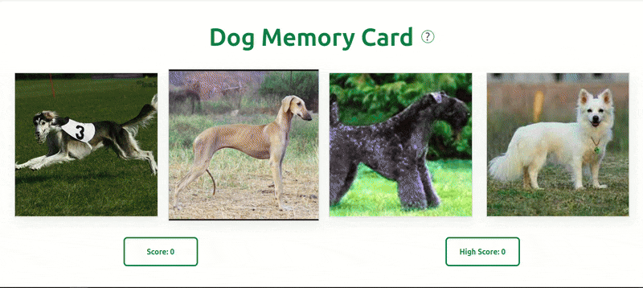
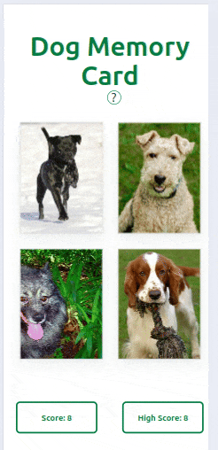

# The Odin Project - Memory Card

## Summary

Another great Odin project that is a small game of memory cards, having to make sure not to click on the same card twice, using state and effect to handle the re-renders and storage of data.

## Model

### Index

|  Desktop                                                                    | Mobile                                                                   |
| --------------------------------------------------------------------------- | ------------------------------------------------------------------------ |
|  |  |

## Project Highlights:

- Calling the Dog API inside a `useEffect` to gather the dog images for the cards. Using the `clicked` state as a dependency.
- Giving the user a how to guide, using things like `absolute` to bring it off the UI.
- Clearly showing the current score and high score.
- Using `display: grid;` to neatly show the UI and make the app more responsive to the users screen.
- Having a simple design and colour throughout to showcase the apps functionality.

## Challenges Overcome:

- What to use as the dependency in the `useEffect` and what not to use.
- How to make the app responsive to the user.
- How to fetch the data and handling the data correctly with a `try...catch`
- Handling when a user loses and how to display this.
- Keeping track of the score and handling when the card is clicked and spreading state and creating a new piece of data.

## New Skills Acquired:

- The correct usage of `useEffect`.
- What is best to use as a dependency.
- Lifting state and handling props correctly.
- Mutating state and creating new pieces of data.
- Using the method `.includes` to find a cards ID instead of mapping over the whole array to save space and time.

## Technologies Used:

- HTML
- CSS
- JavaScript
- React
- Vite
